# 1 - 개발 환경 구성

#### 표준 환경 진행을 위해, Github Codespace 환경에서 Prompton Workshop이 진행됩니다. 진행을 위해서는 개인 Github 계정이 필요합니다.  

##### 개발 환경 구성은 아래의 2단계로 진행됩니다.

##### 1) Codespace 상세 환경 구성

##### 2) .env 파일 설정

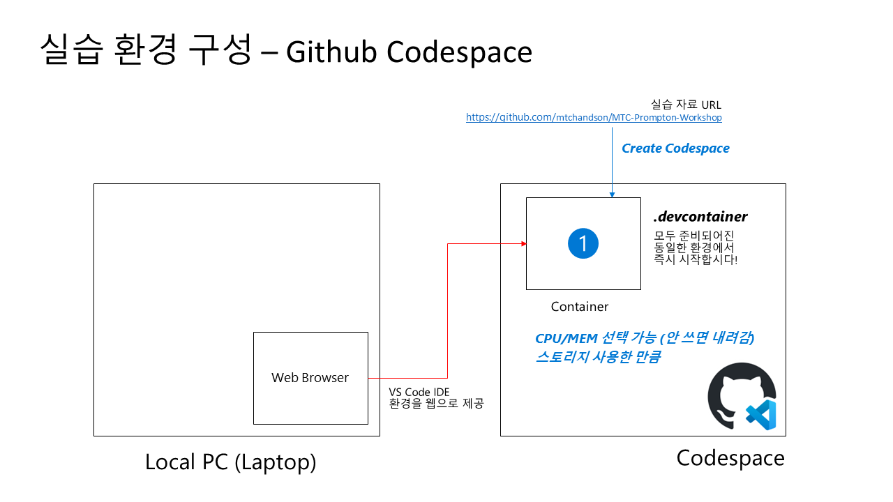

#### **1) Codespace 상세 환경 구성**

1. 웹브라우저에서 [https://github.com/mtchandson/MTC-Prompton-Workshop](https://github.com/mtchandson/MTC-Prompton-Workshop) 실행

   

2. Code > Codespaces 항목에서 'Create codespace on main'을 눌러 실행

   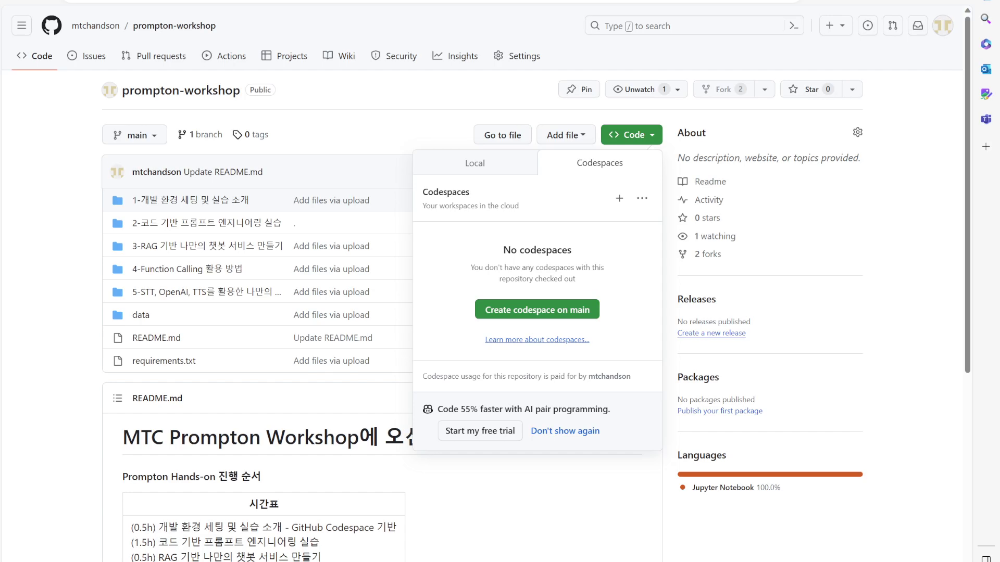

   

3. Github codespace가 아래화면으로 구성이 진행됩니다.

   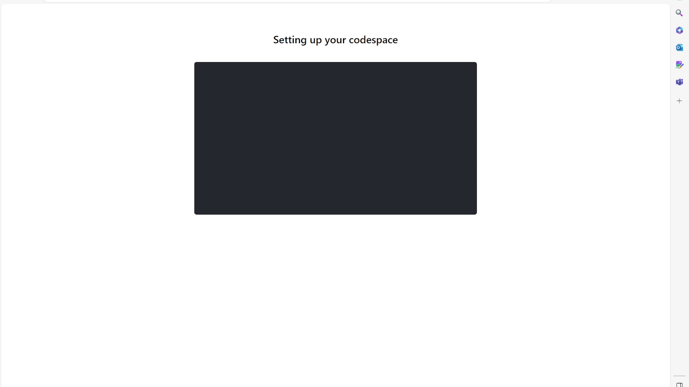

   

4. 설치가 완료되면 왼쪽에 진행 자료의 항목들이 보이는 웹 VS Code환경이 나타납니다.  

   

   

5. 왼쪽 진행 자료 중에 노트북 파일을 선택하면, 오른쪽 하단에 'Python' extension 설치 문의가 나오며, 'Install' 버튼을 눌러 실행합니다.   

   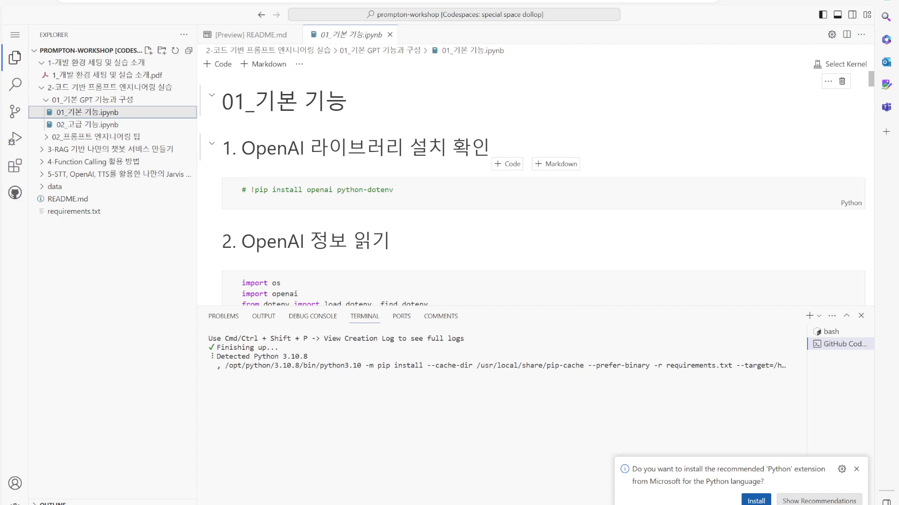

   

6. 'Python' extension이 설치되는 것을 확인합니다. 

   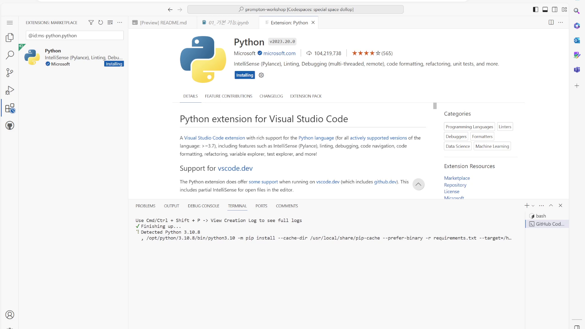

   

7. 설치가 완료되면, 오른쪽 상단의 'Select Kernel'을 누릅니다.

   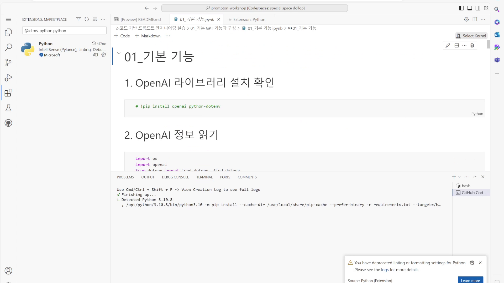

   

8. 가운데 상단에 'Install/Enable suggested extention Python + Jupyter' 항목을 선택합니다.

   

   

9. 오른쪽 하단을 통해 'Python' extension과 'Jupyter' extension이 설치되는 것을 확인합니다.

   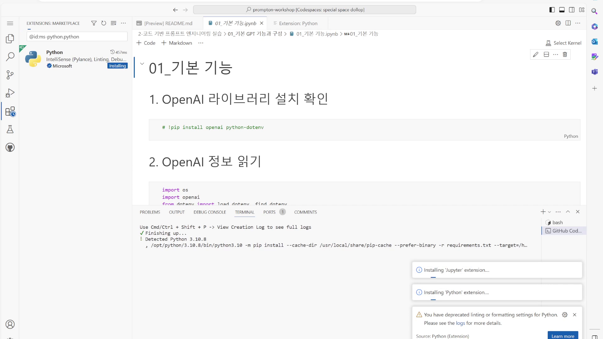

   

10. 설치 완료 이후에 가운데 상단에 'Select Another Kernel'이 나타나고, 여기에 'Python Environments...'를 선택합니다.

    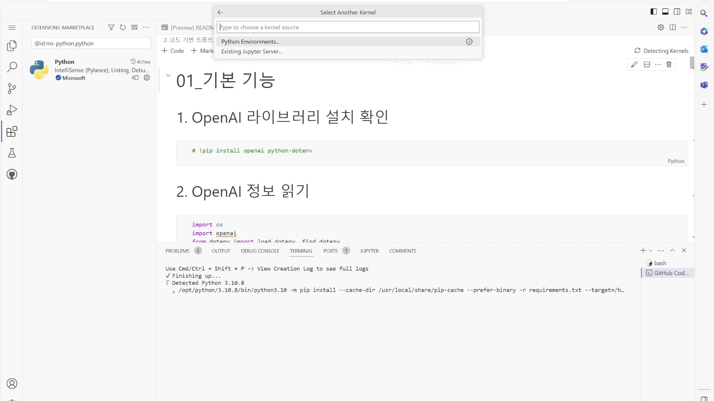

    

11. 이전에 설치된 Recommended 항목인 'Python 3.10.8'을 선택합니다.

    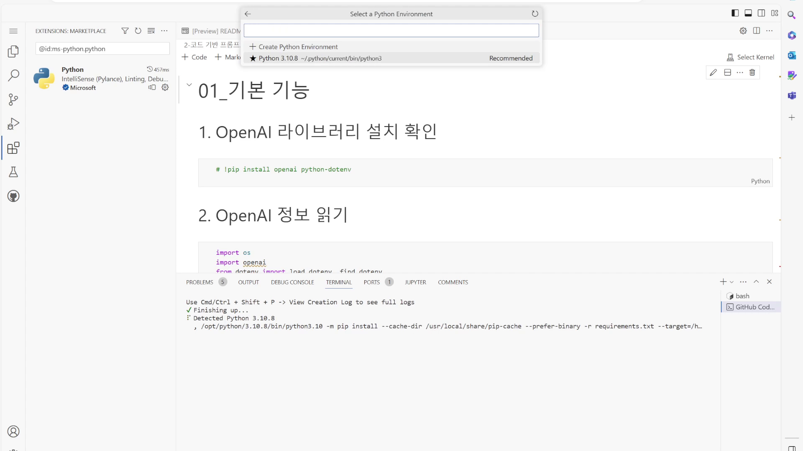

    

12. 오른쪽 상단에 선택한 Python Environment가 'Python 3.10.8'로 나타나면 정상적인 실행 환경이 준비되었습니다.

    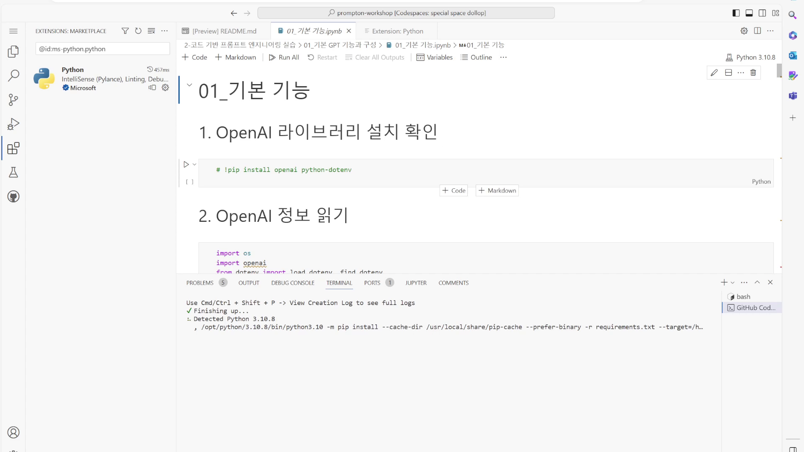

#### **2) .env 파일 설정

1. 이메일을 통해 개별적으로 전달 드린 환경 설정 파일 Zip 파일을 다운로드 합니다. 

   

2. Zip 파일을 푼 이후 파일을 codespace로 drag & drop으로 upload합니다.

   

   

3. Upload된 파일 이름을 'rename' 실행을 통해 '.env' 파일로 변경합니다.

   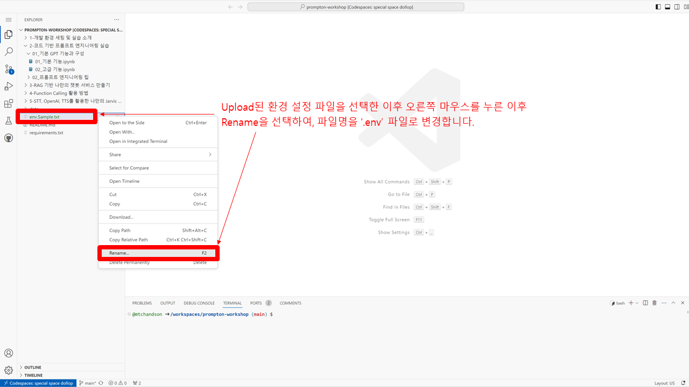

   

4. '.env'로 변경된 파일을 확인합니다. 

   

#### Prompt Workshop  개발 환경 세팅이 완료되었습니다. 이제 함께 실습을 시작해 볼까요?
